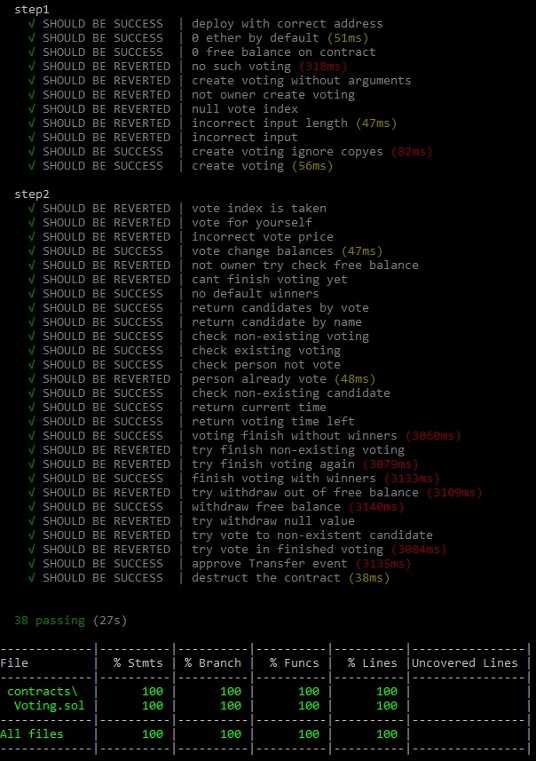
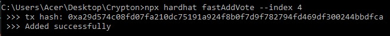
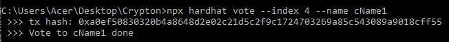
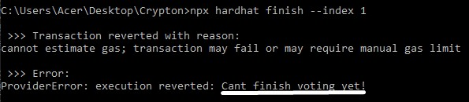
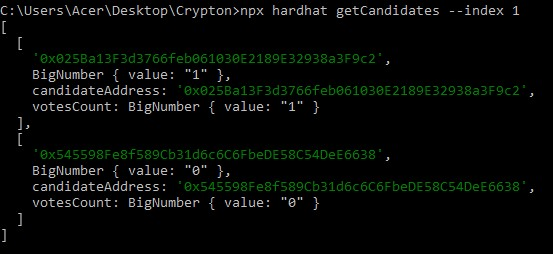

## Привет, меня зовут Илья и это мое решение задачи от Crypton.

##### В данном задании я реализовал простой контракт с динамическим добавлением одновременно выполняющихся голосований.

##### Немного пройдемся по заданию подробнее.

---

>___В папке contracts создан .sol файл, который содержит код контракта___

\> [Voting.sol](https://github.com/ilkatel/CryptonVoting/blob/d8e84f1d8f62fdcc5c57d203751e0ddf98bcce6d/contracts/Voting.sol#L7)

>___В контракте имеется функция создания голосования___

\> [function addVote](https://github.com/ilkatel/CryptonVoting/blob/d8e84f1d8f62fdcc5c57d203751e0ddf98bcce6d/contracts/Voting.sol#L55)

>___В контракте имеется функция вывода комиссии___

\> [function withdraw](https://github.com/ilkatel/CryptonVoting/blob/d8e84f1d8f62fdcc5c57d203751e0ddf98bcce6d/contracts/Voting.sol#L109)

>___В контракте имеется функция голосования___

\> [function vote](https://github.com/ilkatel/CryptonVoting/blob/d8e84f1d8f62fdcc5c57d203751e0ddf98bcce6d/contracts/Voting.sol#L71)

>___В контракте имеется функция завершения голосования___

\> [function finishVote](https://github.com/ilkatel/CryptonVoting/blob/d8e84f1d8f62fdcc5c57d203751e0ddf98bcce6d/contracts/Voting.sol#L167)  
\> Помимо этого, госолование будет автоматически завершено функцией [checkFinishVoting](https://github.com/ilkatel/CryptonVoting/blob/d8e84f1d8f62fdcc5c57d203751e0ddf98bcce6d/contracts/Voting.sol#L147) при попытке в нем поучаствовать по истечению времени.

>___В контракте имеется дополнительныу view функции для вывода информации о голосовании и участниках___

\> [function getCandidate](https://github.com/ilkatel/CryptonVoting/blob/d8e84f1d8f62fdcc5c57d203751e0ddf98bcce6d/contracts/Voting.sol#L99) вернет данные о конкретном участнике в указанном голосовании;  
\> [function getVotingCandidates](https://github.com/ilkatel/CryptonVoting/blob/d8e84f1d8f62fdcc5c57d203751e0ddf98bcce6d/contracts/Voting.sol#L103) вернет данные о всех участниках в указанном голосовании;  
\> [function getWinners](https://github.com/ilkatel/CryptonVoting/blob/d8e84f1d8f62fdcc5c57d203751e0ddf98bcce6d/contracts/Voting.sol#L143) вернет адреса участников лидирующих в текущий момент или победивших в указанном голосовании;  
\> [function getBalance](https://github.com/ilkatel/CryptonVoting/blob/d8e84f1d8f62fdcc5c57d203751e0ddf98bcce6d/contracts/Voting.sol#L171) вернет баланс контракта;  
\> [function getFreeBalance](https://github.com/ilkatel/CryptonVoting/blob/d8e84f1d8f62fdcc5c57d203751e0ddf98bcce6d/contracts/Voting.sol#L175) вернет баланс контракта, который доступен для вывода владельцу;  
\> [function currentTime](https://github.com/ilkatel/CryptonVoting/blob/d8e84f1d8f62fdcc5c57d203751e0ddf98bcce6d/contracts/Voting.sol#L77) вернет текущее время блока в Unix формате;  
\> [function getTimeLeft](https://github.com/ilkatel/CryptonVoting/blob/d8e84f1d8f62fdcc5c57d203751e0ddf98bcce6d/contracts/Voting.sol#L179) вернет оставшееся время указанного голосования в Unix формате.

> ___В проекте утсановлен solidity-coverage и имеются тесты, обеспечивающие полное покрытие по всем показателям___

\> Все тесты располагаются в папке [test](https://github.com/ilkatel/CryptonVoting/blob/d8e84f1d8f62fdcc5c57d203751e0ddf98bcce6d/test/contractTest.js#L4);  
\> Для удобства тесты запускаются в сети hardhat с помощью [скрипта](https://github.com/ilkatel/CryptonVoting/blob/d8e84f1d8f62fdcc5c57d203751e0ddf98bcce6d/package.json#L8);  
\> Реализовано полное покрытие;  
\* Последние тесты показывают большое время выполнения из-за функции засыпания, реализованной для возможности завершения голосования по истечению его времени.

\> 

> ___В папке scripts имеется скрипт для публикации контракта в одну из тестовых сетей___

\> [Скрипт](https://github.com/ilkatel/CryptonVoting/blob/d8e84f1d8f62fdcc5c57d203751e0ddf98bcce6d/scripts/deploy.js#L1) деплоит контракт в сеть Rinkeby, которая [установлена по умолчанию](https://github.com/ilkatel/CryptonVoting/blob/d8e84f1d8f62fdcc5c57d203751e0ddf98bcce6d/hardhat.config.js#L19).

> ___В папке tasks имеются hardhat task`и, позволяющие взаимодействовать с опубликованным контрактом___

\> Для примера [все task'и](https://github.com/ilkatel/CryptonVoting/blob/d8e84f1d8f62fdcc5c57d203751e0ddf98bcce6d/tasks/contractTasks.js#L1) выполняются от лица владельца контракта.  
\> Рассмотрим несколько примеров
* Добавление голосования: 
[Полноценный вариант](https://github.com/ilkatel/CryptonVoting/blob/d8e84f1d8f62fdcc5c57d203751e0ddf98bcce6d/tasks/contractTasks.js#L138) 
[Упрощенный вариант для тестов](https://github.com/ilkatel/CryptonVoting/blob/d8e84f1d8f62fdcc5c57d203751e0ddf98bcce6d/tasks/contractTasks.js#L162) 

* [Участие в голосовании](https://github.com/ilkatel/CryptonVoting/blob/d8e84f1d8f62fdcc5c57d203751e0ddf98bcce6d/tasks/contractTasks.js#L208): 

* [Завершение голосования](https://github.com/ilkatel/CryptonVoting/blob/d8e84f1d8f62fdcc5c57d203751e0ddf98bcce6d/tasks/contractTasks.js#L225): 
Пример откаченной транзакции (голосование еще идет) 

* [Получение списка участников](https://github.com/ilkatel/CryptonVoting/blob/d8e84f1d8f62fdcc5c57d203751e0ddf98bcce6d/tasks/contractTasks.js#L176): 

* [И многое другое...](https://github.com/ilkatel/CryptonVoting/blob/d8e84f1d8f62fdcc5c57d203751e0ddf98bcce6d/tasks/contractTasks.js#L1)

---
### Немного подробнее

Я решил реализовать работу с участниками по имени, а хранить их имена в байтовом виде. Сразу стоит отметить, что все task'и реализованы так, что при обращении к контракту можно указывать имена участников как в строковом формате, так и в байтовом. Имена в пределах одного голосования должны быть уникальными. Если при создании голосования будут участники с одинаковыми именами, дубликаты будут пропущены.
Голосованиям же присваивается уникальный индекс (>0), по которому можно с ними взаимодействовать.
Завершить голосование может любой пользователь по истечению времени. Помимо этого, голосование завершится само при попытке проголосовать по истечению времени.
Владелец может снять любую доступнную сумму в любой момент.

Все тесты являются изолированными и никак не пересекаются.
В task'ах написаны функции вывода ошибок в читабельном формате, функции обработки и проверки данных. 

---

Текущий адрес развернутого контракта [0x91E18084a48dE79C9C1Af509E97F5997161c3c2C](https://rinkeby.etherscan.io/address/0x91E18084a48dE79C9C1Af509E97F5997161c3c2C) 
Автор ilkatel 

$ echo \\"bye.\\"
